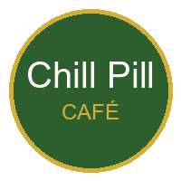

# 🍽️ Chill Pill Café - Premium Restaurant Website

A modern, elegant, and fully responsive multi-page restaurant website built with Flask, featuring a clean UI, premium design, and comprehensive functionality.



## ✨ Features

### 📄 Pages (9 Complete Pages)
1. **Home** - Hero section, signature dishes, testimonials
2. **About Us** - Story, mission, values, team
3. **Menu** - Categorized dishes with dietary info
4. **Reservation** - Booking form with confirmation
5. **Gallery** - Filterable image gallery
6. **Cuisine Types** - Indian, Italian, Continental, Fusion
7. **Why We Stand Out** - Unique selling points
8. **Contact Us** - Location, hours, contact form
9. **Feedback** - Star rating and review system

### 🎨 Design Features
- ✅ Modern, minimalistic, professional UI
- ✅ Consistent color palette (Green, Brown, Gold theme)
- ✅ Premium typography (Playfair Display + Poppins)
- ✅ Fully responsive design for all devices
- ✅ Smooth animations and transitions
- ✅ Elegant gradient overlays
- ✅ Clean spacing and alignment
- ✅ Professional logo design

### 🛠️ Technical Features
- ✅ Flask backend with all routes
- ✅ Template inheritance (base.html)
- ✅ Form validation (JavaScript + Python)
- ✅ Sticky navigation with scroll effects
- ✅ Mobile-responsive hamburger menu
- ✅ Back-to-top button
- ✅ Flash messages system
- ✅ SEO-friendly structure
- ✅ Accessibility features
- ✅ Performance optimized

## 🚀 Installation & Setup

### Prerequisites
- Python 3.8 or higher
- pip (Python package manager)

### Step 1: Install Dependencies
```bash
pip install -r requirements.txt
```

### Step 2: Generate Placeholder Images
```bash
python generate_images.py
```

This will create all necessary images in the `static/images/` directory including:
- Logo
- Hero images
- Food photos (starters, mains, desserts, beverages)
- Gallery images
- Team photos
- Cuisine images

### Step 3: Run the Application
```bash
python app.py
```

The website will be available at: `http://localhost:5000`

## 📁 Project Structure

```
Chill Pill Café/
│
├── app.py                          # Flask application with all routes
├── requirements.txt                # Python dependencies
├── generate_images.py              # Image generator script
├── README.md                       # This file
│
├── templates/                      # HTML templates
│   ├── base.html                   # Base template with navbar & footer
│   ├── index.html                  # Home page
│   ├── about.html                  # About Us page
│   ├── menu.html                   # Menu page
│   ├── reservation.html            # Reservation form
│   ├── reservation_confirmation.html
│   ├── gallery.html                # Gallery page
│   ├── cuisine.html                # Cuisine types page
│   ├── why_us.html                 # Why We Stand Out page
│   ├── contact.html                # Contact page
│   ├── feedback.html               # Feedback page
│   └── 404.html                    # Error page
│
└── static/                         # Static assets
    ├── css/
    │   └── style.css               # Main stylesheet (comprehensive)
    ├── js/
    │   └── script.js               # JavaScript for interactivity
    └── images/                     # Generated images
        ├── logo.png
        ├── hero_ambience.jpg
        ├── [50+ generated images]
        └── ...
```

## 🎯 Key Routes

| Route | Method | Description |
|-------|--------|-------------|
| `/` | GET | Home page |
| `/about` | GET | About Us page |
| `/menu` | GET | Menu with all dishes |
| `/reservation` | GET, POST | Reservation form & booking |
| `/gallery` | GET | Photo gallery |
| `/cuisine` | GET | Cuisine types |
| `/why-us` | GET | Why We Stand Out |
| `/contact` | GET | Contact information |
| `/feedback` | GET, POST | Feedback & reviews |

## 🎨 Design Specifications

### Color Palette
- **Primary Green**: `#2c5f2d`
- **Secondary Gold**: `#d4af37`
- **Accent Brown**: `#8b4513`
- **Background**: `#ffffff`
- **Text**: `#2d3436`

### Typography
- **Headings**: Playfair Display (Serif)
- **Body**: Poppins (Sans-serif)

### Responsive Breakpoints
- Desktop: 1200px+
- Tablet: 768px - 1199px
- Mobile: < 768px

## 📋 Menu Structure

### Starters
- Bruschetta Trio
- Paneer Tikka
- Chicken Wings
- Mezze Platter

### Main Course (5 dishes, 3 Chef's Specials)
- Butter Chicken ⭐
- Risotto Al Funghi
- Grilled Sea Bass ⭐
- Dal Makhani
- Truffle Pasta ⭐

### Desserts
- Tiramisu
- Gulab Jamun Cheesecake ⭐
- Chocolate Lava Cake

### Beverages
- Café Latte
- Mumbai Masala Chai
- Fresh Lime Soda
- Mango Lassi

## 🌟 Dietary Icons
- 🌿 Vegetarian
- 🌱 Vegan
- 🌶️ Spicy
- ⭐ Chef's Special

## 📍 Location
**Bandra West, Mumbai, Maharashtra, India**

## 📞 Contact Information
- **Phone**: +91 98765 43210
- **Email**: info@chillpillcafe.com
- **Hours**: 
  - Mon-Thu: 11:00 AM - 11:00 PM
  - Fri-Sun: 10:00 AM - 12:00 AM

## 🔧 Customization

### Changing Colors
Edit the CSS variables in `static/css/style.css`:
```css
:root {
    --primary-color: #2c5f2d;
    --secondary-color: #d4af37;
    --accent-color: #8b4513;
}
```

### Adding Menu Items
Edit the menu data dictionary in `app.py`:
```python
menu_data = {
    'starters': [...],
    'mains': [...],
    ...
}
```

### Updating Contact Info
Edit the contact_info dictionary in `app.py`:
```python
contact_info = {
    'address': 'Your Address',
    'phone': 'Your Phone',
    ...
}
```

## 🚀 Deployment

### Heroku
```bash
# Create Procfile
echo "web: gunicorn app:app" > Procfile

# Add gunicorn to requirements.txt
echo "gunicorn==21.2.0" >> requirements.txt

# Deploy
heroku create your-app-name
git push heroku main
```

### PythonAnywhere
1. Upload files to PythonAnywhere
2. Set up virtual environment
3. Configure WSGI file
4. Reload application

## 📈 Performance Features
- Lazy image loading
- Debounced scroll events
- Optimized CSS/JS
- Minimal dependencies
- Fast page load times

## ♿ Accessibility
- ARIA labels
- Keyboard navigation
- Semantic HTML
- Screen reader friendly
- High contrast ratios

## 📱 Mobile Responsive
- Hamburger menu
- Touch-friendly buttons
- Optimized images
- Flexible layouts
- Mobile-first approach

## 🔒 Security Features
- Form validation (client & server)
- CSRF protection ready
- Input sanitization
- Secure secret key
- Error handling

## 🐛 Known Issues & Future Enhancements
- [ ] Add database integration (SQLite/PostgreSQL)
- [ ] Implement email notifications
- [ ] Add payment gateway for advance booking
- [ ] Create admin dashboard
- [ ] Add online ordering system
- [ ] Implement user authentication
- [ ] Add multi-language support

## 👥 Credits
**Developed for Chill Pill Café**
- Modern restaurant website template
- Flask backend implementation
- Responsive UI/UX design
- AI-generated placeholder images

## 📄 License
This project is created for Chill Pill Café.

## 💡 Support
For questions or support, contact: info@chillpillcafe.com

---

**Made with ❤️ for the best dining experience in Mumbai**

*"Where culinary artistry meets tranquil ambience"*
